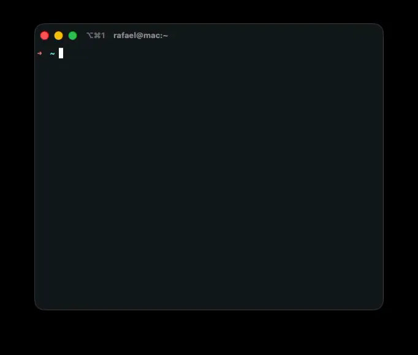

# m2a

<p align="center">
  <strong>Talk to A2A agents from your terminal</strong>
</p>

<p align="center">
  <a href="https://go.dev/"></a>
  <a href="./LICENSE"></a>
  <a href="https://github.com/mantyx-io/m2a/actions/workflows/ci.yml"></a>
  <a href="https://github.com/mantyx-io/m2a/releases"></a>
</p>

**m2a** is a small, keyboard-driven CLI for the [Agent2Agent (A2A) protocol](https://a2a-protocol.org/latest/). It loads an agent card, connects over **HTTP+JSON** or **JSON-RPC**, and opens a [Bubble Tea](https://github.com/charmbracelet/bubbletea) chat UI—with optional auth headers, markdown rendering, and request/response debug traces.

Built by [MANTYX](https://mantyx.io) using the official **[a2a-go](https://github.com/a2aproject/a2a-go)** SDK.

---

## Demo

Animated preview of **m2a** in the terminal (chat input, transcript, and a markdown-formatted agent reply). Source: [`examples/demo.webp`](examples/demo.webp).



---

## Table of contents

- [Demo](#demo)
- [Features](#features)
- [Installation](#installation)
- [Quick start](#quick-start)
- [CLI reference](#cli-reference)
- [Flags after the URL](#flags-after-the-url)
- [Transports](#transports-protocol-bindings)
- [Development](#development)
- [Releases](#releases)
- [Contributing & license](#contributing--license)

---

## Features

| | |
| --- | --- |
| **Discovery** | Loads `/.well-known/agent-card.json` from a base URL, or a **direct card URL** |
| **Sparse cards** | If `supportedInterfaces` is missing, infers endpoints from `-base` or `-card` (see [Transports](#transports-protocol-bindings)) |
| **Transports** | **HTTP+JSON** and **JSON-RPC** via a2a-go; `-transport` picks a binding when the card lists several |
| **Headers** | Repeatable `-H 'Name: Value'` on **every** request (card fetch + A2A)—ideal for `Authorization`, API keys, tracing |
| **Transcript** | Scrollable chat log (each send is a separate `SendMessage`; multi-turn is up to the agent) |
| **Markdown** | Agent replies rendered with [Glamour](https://github.com/charmbracelet/glamour); use **`-raw`** for plain text |
| **Debug** | **`-debug`** logs indented JSON for each `SendMessage` request and response in the transcript |
| **Version** | **`m2a version`** or **`-version`** prints the build version |

---

## Installation

### Option A — `go install` (any platform with Go 1.24.4+)

```bash
go install github.com/mantyx-io/m2a/cmd/m2a@latest
```

### Option B — Install script (Linux / macOS, `amd64` / `arm64`)

Installs the latest [GitHub release](https://github.com/mantyx-io/m2a/releases) binary into `~/.local/bin` (override with `PREFIX`).

```bash
curl -fsSL https://raw.githubusercontent.com/mantyx-io/m2a/main/scripts/install.sh | bash
```

If you prefer not to pipe the script on **stdin**, use this instead (no temp file; same effect as `bash scripts/install.sh` from a clone):

```bash
bash -c "$(curl -fsSL https://raw.githubusercontent.com/mantyx-io/m2a/main/scripts/install.sh)"
```

Pin a specific version:

```bash
VERSION=v1.2.3 curl -fsSL https://raw.githubusercontent.com/mantyx-io/m2a/main/scripts/install.sh | bash
```

System-wide install (requires write access to the prefix):

```bash
PREFIX=/usr/local curl -fsSL https://raw.githubusercontent.com/mantyx-io/m2a/main/scripts/install.sh | bash
```

The script needs **`curl`**, **`tar`**, and either **`jq`** or **`python3`** to resolve `latest` from the GitHub API (or set **`VERSION`** explicitly).

### Option C — From source

```bash
git clone https://github.com/mantyx-io/m2a.git
cd m2a
go build -o m2a ./cmd/m2a/
```

Windows binaries are attached to each GitHub release (`.zip`); use the archive for your OS and architecture.

---

## Quick start

```bash
# One argument = agent base URL (well-known card)
m2a https://your-agent.example.com

# Or explicit base + auth header
m2a -base https://your-agent.example.com \
  -H 'Authorization: Bearer YOUR_TOKEN'
```

Inside the TUI: **Enter** sends, **Esc** or **Ctrl+C** quits, mouse wheel scrolls the transcript.

```bash
m2a version
# or
m2a -version
```

---

## CLI reference

| Flag | Description |
| --- | --- |
| `-base` | Agent origin; fetches `/.well-known/agent-card.json` unless `-card` is set |
| `-card` | Full URL to the agent card JSON (**either** `-base` **or** `-card`, not both) |
| `-card-path` | Path under `-base` instead of the default well-known location |
| `-transport` | `auto` (default), `http` / `rest` / `http+json`, or `jsonrpc` (`grpc` is not supported in this binary) |
| `-H` | HTTP header `Name: Value` (repeatable) |
| `-raw` | Plain text agent replies (no terminal markdown) |
| `-debug` | Log `SendMessage` request/response JSON in the chat transcript |
| `-version` | Print version and exit |

You can pass the agent base URL as a **single positional** argument instead of `-base`.

```bash
m2a -h
```

---

## Flags after the URL

Boolean flags and other options may appear **after** the base URL (e.g. `m2a https://host -debug`). The CLI reorders arguments before parsing so this matches common expectations. Words **`debug`**, **`raw`**, and **`version`** alone are not treated as URLs—use **`-debug`**, **`-raw`**, **`m2a version`**, or **`-version`**.

---

## Transports (protocol bindings)

The [A2A specification](https://a2a-protocol.org/latest/specification/) defines protocol bindings. Your agent card should list them under `supportedInterfaces` with `protocolBinding` and `url`.

| Binding | Value in the card | What m2a does |
| --- | --- | --- |
| **HTTP+JSON** (REST) | `HTTP+JSON` | `POST` to paths such as `/message:send` (a2a-go REST client) |
| **JSON-RPC 2.0** | `JSONRPC` | `POST` JSON-RPC (e.g. `SendMessage`) |
| **gRPC** | `GRPC` | Supported in a2a-go via [`a2agrpc`](https://pkg.go.dev/github.com/a2aproject/a2a-go/v2/a2agrpc/v1); **not wired in this CLI** |

**Choosing a transport**

1. Prefer a full agent card with correct `supportedInterfaces`.
2. Use **`-transport`** when you know what the server speaks:
   - `auto` (default) — with a **sparse** card, try **HTTP+JSON** then **JSON-RPC** at the same base URL; with a **full** card, follow the card order (subject to SDK sorting).
   - `http` (aliases: `rest`, `http+json`) — only **HTTP+JSON**.
   - `jsonrpc` — only **JSON-RPC**.

```bash
m2a -base https://your-agent.example.com -transport http
m2a -base https://your-agent.example.com -transport jsonrpc
```

---

## Development

```bash
go test ./...
go run ./cmd/m2a/ https://localhost:8080
```

CI runs on pushes and pull requests to `main` / `master`: `go mod verify`, `go test ./...`, and `go build` (see [.github/workflows/ci.yml](.github/workflows/ci.yml)).

### Example agent (Gemini)

[`examples/gemini-agent/`](examples/gemini-agent/) is a small local A2A server that forwards chat to **Gemini**. Set `GEMINI_API_KEY` or `GOOGLE_API_KEY`, start the example, then point m2a at it, e.g. `m2a -base http://127.0.0.1:8080`.

---

## Releases

Publishing a version:

1. Commit your changes on `main`.
2. Create and push an annotated tag **`v*`** (semantic version), for example:
   ```bash
   git tag v1.2.3
   git push origin v1.2.3
   ```
3. The [Release workflow](.github/workflows/release.yml) builds binaries for **linux** / **darwin** / **windows** (`amd64`, plus `arm64` for Linux and macOS), uploads `m2a_<tag>_<os>_<arch>.tar.gz` (or `.zip` on Windows) and `checksums-sha256.txt`, and creates a GitHub Release with notes.

The embedded version string is set at link time (`-ldflags`), so **`m2a -version`** matches the release tag.

---

## Contributing & license

See **[CONTRIBUTING.md](CONTRIBUTING.md)** for setup, the checks we run in CI, and PR expectations.

This project is released under the [MIT License](LICENSE).

---

## Links

| Resource | URL |
| --- | --- |
| **MANTYX** | [mantyx.io](https://mantyx.io) |
| **A2A specification** | [a2a-protocol.org](https://a2a-protocol.org/latest/) |
| **Official Go SDK** | [a2aproject/a2a-go](https://github.com/a2aproject/a2a-go) |
| **Repository** | [github.com/mantyx-io/m2a](https://github.com/mantyx-io/m2a) |
| **Contributing** | [CONTRIBUTING.md](CONTRIBUTING.md) |
